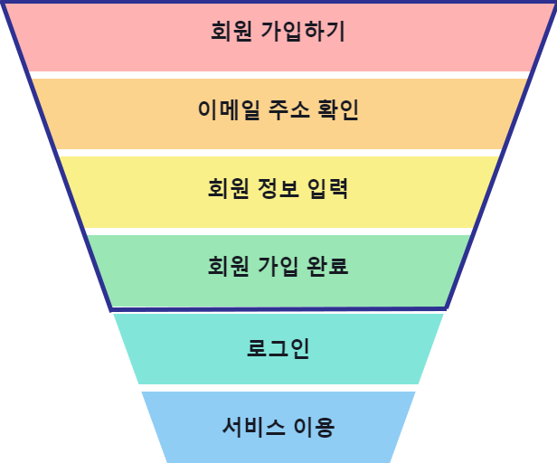
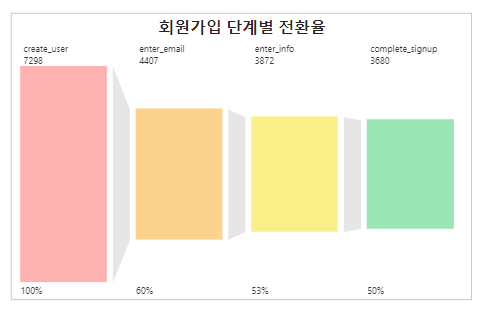
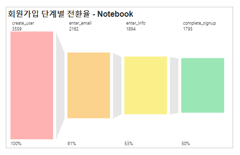
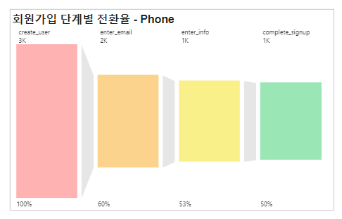
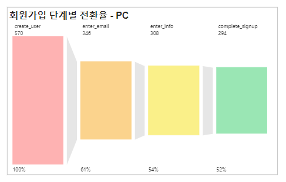
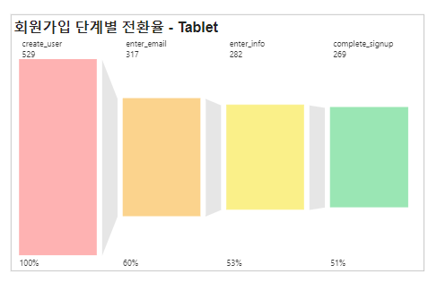
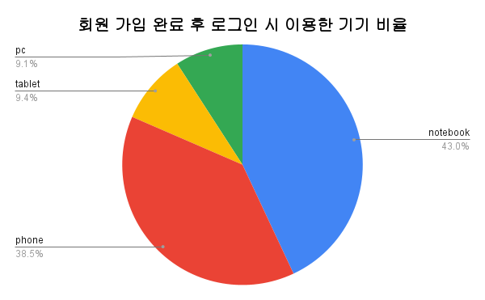

# 💻Funnel 분석을 통한 서비스 회원 가입 유도 방안
<br>

---
작성자: Bora Lee  
태그: 퍼널분석, 프로젝트  
Skills: Google Sheets, PostgreSQL, Power BI  
기간: July 31, 2023 → August 10, 2023  
기여도: 100%

---

<br>


## 1️⃣ 분석 목적

### 1. 분석 가정 및 목적

 Yammer는 기업용 소셜 네트워크 서비스로 조직 내 다양한 사람들과 아이디어 및 경험을 공유할 수 있는 커뮤니티 공간 및 협업 툴 기능을 제공하고 있습니다. Yammer 분석팀은 데이터를 이용하여 서비스의 발전을 개선하고 비즈니스 의사 결정에 도움을 주기 위해 노력하고 있습니다. Yammer의 이번 목표는 신규 가입자 수를 늘리는 것입니다. 이에 맞추어 분석팀은 퍼널 분석을 통해 회원 가입 절차를 점검하고 신규 회원 가입자를 늘리기 위한 방안을 모색하고자 합니다.

### 2. 분석 방법

#### 퍼널 분석

- 퍼널 분석은 이용자들의 서비스 최초 유입부터 최종적인 핵심 기능을 사용하기까지 여정을 단계를 나누어서 살펴보는 분석 기법입니다. 각 단계를 통과할 때마다 이용자 수가 줄어들게 되는데 그 모습이 깔때기(Funnel) 모양과 비슷하여 퍼널 분석이라고 합니다. 각각의 단계로 넘어가는 것을 전환(Conversion)이라고 부르고 그 비율은 전환율(Conversion rate)이라 합니다.
- 퍼널 단계 설정 : Yammer를 이용하기 위해서는 아래와 같은 단계를 거쳐야 합니다. 서비스를 이용하려면 먼저 회원 가입 절차를 거쳐야 하기 때문에 회원 가입하기 ~ 회원 가입 완료 단계의 전환율을 알아보고자 합니다.

|  | 1. 회원 가입하기(create_user) <br> &nbsp;  - 회원 가입을 위한 가입 페이지 이동 <br> <br> 2. 이메일 주소 확인(enter_email) <br> &nbsp;  - 이메일 주소를 이용하여 본인 확인 <br> <br> 3. 회원 정보 입력(enter_info) <br> &nbsp;  - 이름 등 개인 정보 입력 <br> <br> 4. 회원 가입 완료(complete_signup) <br> &nbsp;  - 회원 가입 완료 버튼을 누르면 가입 완료 페이지로 이동 |
|:---|:---|

<br>

## 2️⃣ 분석 결과

### 1. 회원 가입 단계별 전환율

> 데이터 수집 기간은 4개월입니다.
4개월 동안 Yammer 방문 관련 이벤트가 기록된 이용자는 총 9760명이고 이 중 7298명이 회원 가입을 위해 방문하였습니다.
> 


|🔖 회원 가입 페이지로 이동한 이용자(7298명) 중 50%가 최종 가입을 완료하였습니다. <br> 각 단계별 전환율을 비교하였을 때 이메일 주소 확인(enter_email) 단계로 이동할 때 가장 많은 이탈이 발생하고 있습니다.|
|:-|




1. 각 단계로 이동한 이용자 수

| create_user | enter_email | enter_info | complete_signup |
| --- | --- | --- | --- |
| 7298 | 4407 | 3872 | 3680 |

<a id = "target">2. 단계별 전환율 </a>

| create_user → enter_email 전환율 | email_email → enter_info 전환율 | enter_info → complete_signup 전환율 | **회원 가입 완료 전환율** |
| --- | --- | --- | --- |
| 0.6039 | 0.8786 | 0.9504 | 0.5042 |
- 회원 가입 페이지로 이동한 이용자(create_user) 중 50%의 이용자가 회원 가입을 완료하였습니다.
- 각 단계별 전환율을 비교해 보았을 때 회원가입 페이지 이동(create_user) → 이메일 주소 확인(enter_email)의 전환율이 60.39%로 가장 낮게 나타났습니다.

<details>
<summary> SQL Query - 단계별 전환율</summary>
<div markdown = 1>    
    
```sql
    WITH create_user AS (
      SELECT user_id
           , occurred_at AS create_at
      FROM tutorial.yammer_events
      WHERE event_name = 'create_user'
    ), email AS (
      SELECT user_id
           , occurred_at AS email_at
      FROM tutorial.yammer_events
      WHERE event_name = 'enter_email'
    ), info AS (
      SELECT user_id
           , occurred_at AS info_at
      FROM tutorial.yammer_events
      WHERE event_name = 'enter_info'
    ), complete AS (
      SELECT user_id
           , occurred_at AS complete_at
      FROM tutorial.yammer_events
      WHERE event_name = 'complete_signup'
    )
    
    SELECT COUNT(DISTINCT create_user.user_id) create_user
         , COUNT(DISTINCT email.user_id) AS enter_email
         , COUNT(DISTINCT info.user_id) AS enter_info
         , COUNT(DISTINCT complete.user_id) AS complete_signup
         , COUNT(DISTINCT email.user_id)::float / COUNT(DISTINCT create_user.user_id) AS create_email_rate
         , COUNT(DISTINCT info.user_id)::float  / COUNT(DISTINCT email.user_id) AS email_info_rate
         , COUNT(DISTINCT complete.user_id)::float  / COUNT(DISTINCT info.user_id) AS info_complete_rate
         , COUNT(DISTINCT complete.user_id)::float  / COUNT(DISTINCT create_user.user_id) AS create_complete_rate
    FROM create_user 
         LEFT JOIN email ON create_user.user_id = email.user_id
                         AND create_at <= email_at
         LEFT JOIN info ON email.user_id = info.user_id 
                        AND email_at <= info_at
         LEFT JOIN complete ON info.user_id = complete.user_id
                            AND info_at <= complete_at;
```
</div>
</details>

<br>

### 2. 이용 기기 종류별 회원 가입 전환율

> 회원 가입 시 이용하는 기기가 전환율에 영향을 주는지 확인하기 위해 기기별 회원 가입 단계 전환율을 구해보았습니다.
사용 기기의 카테고리를 notebook, phone, pc, tablet 네 종류로 구분하였습니다.
> 

<aside>
🔖 회원 가입 전환율은 기기 종류에 상관없이 단계별로 비슷한 전환율을 보입니다.
회원 가입을 완료한 이용자 대부분이 휴대성이 용이한 기기(노트북, 휴대폰, 태블릿)를 이용하여 가입을 진행했습니다.

</aside>

1. 각 단계로 이동한 이용자 수

| device_category | create_user | enter_email | enter_info | complete_signup |
| --- | --- | --- | --- | --- |
| notebook | 3559 | 2162 | 1894 | 1795 |
| phone | 2640 | 1582 | 1388 | 1322 |
| pc | 570 | 346 | 308 | 294 |
| tablet | 529 | 317 | 282 | 269 |

2. 단계별 전환율

| 기기 종류 | create_user → enter_email 전환율 | enter_email → enter_info 전환율 | enter_info → complete_signup 전환율 | **회원 가입 완료 전환율** |
| --- | --- | --- | --- | --- |
| notebook | 0.6075 | 0.8760 | 0.9477 | 0.5044 |
| phone | 0.5992 | 0.8774 | 0.9524 | 0.5008 |
| pc | 0.6070 | 0.8902 | 0.9539 | 0.5158 |
| tablet | 0.5992 | 0.8896 | 0.9539 | 0.5085 |

<p>
      &nbsp;
     
</p>

<p>
      &nbsp;
     
</p>

- 각 기기별 회원 가입 단계 전환율은 큰 차이를 보이지 않습니다.
- PC 뿐만 아니라 휴대가 용이한 노트북, 휴대폰, 태블릿을 이용한 가입도 많이 이루어짐을 알 수 있습니다.

<details>
<summary> SQL Query - 기기별 회원가입 전환율</summary>
<div markdown = 1>    

    
```sql
    WITH create_user AS (
      SELECT user_id
           , device
           , occurred_at AS create_at
      FROM tutorial.yammer_events
      WHERE event_name = 'create_user'
    ), email AS (
      SELECT user_id
           , occurred_at AS email_at
      FROM tutorial.yammer_events
      WHERE event_name = 'enter_email'
    ), info AS (
      SELECT user_id
           , occurred_at AS info_at
      FROM tutorial.yammer_events
      WHERE event_name = 'enter_info'
    ), complete AS (
      SELECT user_id
           , occurred_at AS complete_at
      FROM tutorial.yammer_events
      WHERE event_name = 'complete_signup'
    )
    
    SELECT CASE 
                WHEN create_user.device IN ('ipad air', 'ipad mini', 'kindle fire', 'samsumg galaxy tablet') THEN 'tablet'
                WHEN create_user.device IN ('iphone 5', 'nexus 5', 'iphone 5s', 'iphone 4s', 'nexus 7', 'nexus 10', 'nokia lumia 635', 'samsung galaxy s4', 'htc one', 'samsung galaxy note', 'amazon fire phone') THEN 'phone'
                WHEN create_user.device LIKE '%desktop%' OR create_user.device = 'mac mini' THEN 'pc'
           ELSE 'notebook' END AS device_category
         , COUNT(DISTINCT create_user.user_id) create_user
         , COUNT(DISTINCT email.user_id) AS enter_email
         , COUNT(DISTINCT info.user_id) AS enter_info
         , COUNT(DISTINCT complete.user_id) AS complete_signup
         , COUNT(DISTINCT email.user_id)::float / COUNT(DISTINCT create_user.user_id) AS create_email_rate
         , COUNT(DISTINCT info.user_id)::float  / COUNT(DISTINCT email.user_id) AS email_info_rate
         , COUNT(DISTINCT complete.user_id)::float  / COUNT(DISTINCT info.user_id) AS info_complete_rate
         , COUNT(DISTINCT complete.user_id)::float  / COUNT(DISTINCT create_user.user_id) AS create_complete_rate
    FROM create_user 
         LEFT JOIN email ON create_user.user_id = email.user_id
                         AND create_at <= email_at
         LEFT JOIN info ON email.user_id = info.user_id 
                        AND email_at <= info_at
         LEFT JOIN complete ON info.user_id = complete.user_id
                            AND info_at <= complete_at
    GROUP BY device_category
    ORDER BY create_user DESC;
```
</div>
</details>
    

### 3. 국가별 회원 가입 전환율

> 이벤트 발생 시 기록된 위치를 기반으로 각 나라별 회원 가입 전환율을 구해보았습니다.
회원 가입 관련 이벤트가 발생한 나라는 총 47개국입니다. 이 중 회원 가입 완료 전환율을 기준으로 상위 10개 국가, 하위 10개 국가를 살펴보았습니다.
(회원 가입 완료 전환율 : 회원 가입 완료자 수 / 회원 가입하기로 이동한 이용자 수로, 회원 가입을 페이지로 진입한 이용자 중 회원 가입을 완료한 이용자 비율을 의미합니다.)
> 

|🔖 회원 가입 완료 전환율을 기준 상위 10개, 하위 10개 국가의 단계별 전환율을 비교하였을 때 회원 가입하기(create_user) → 이메일 주소 확인하기(enter_email) 전환율의 차이가 두드러지게 나타남을 알 수 있었습니다.|
|:-|


1. 회원 가입 완료 전환율이 높은 10개 국가의 회원 가입 단계별 전환율

| **이용 국가** | create_user → enter_email **전환율** | enter_email → enter_info **전환율** | enter_info → complete_signup **전환율** | **회원 가입 완료 전환율** |
| --- | --- | --- | --- | --- |
| Philippines | <span style = "font-weight: bold; color: blue;"> 0.79 </span> | 0.91 | 0.97 | <span style = "font-weight: bold; color: blue;">0.69</span> |
| Iraq | 0.67 | 0.94 | 1 | 0.63 |
| Korea | 0.71 | 0.9 | 0.98 | 0.62 |
| South Africa | 0.65 | 0.93 | 1 | 0.6 |
| Sweden | 0.68 | 0.9 | 0.96 | 0.59 |
| Colombia | 0.67 | 1 | 0.88 | 0.59 |
| Mexico | 0.63 | 0.93 | 0.99 | 0.58 |
| Malaysia | 0.65 | 0.93 | 0.96 | 0.58 |
| Israel | 0.68 | 0.89 | 0.96 | 0.58 |
| Singapore | 0.64 | 0.91 | 1 | 0.58 |

2. 회원 가입 완료 전환율이 낮은 10개 국가의 회원 가입 단계별 전환율

| **이용 국가** | create_user → enter_email **전환율** | enter_email → enter_info **전환율** | enter_info → complete_signup **전환율** | **회원 가입 완료 전환율** |
| --- | --- | --- | --- | --- |
| Thailand | 0.51 | 0.93 | 0.96 | 0.46 |
| Brazil | 0.56 | 0.88 | 0.9 | 0.45 |
| Spain | 0.56 | 0.9 | 0.9 | 0.45 |
| Nigeria | 0.6 | 0.81 | 0.92 | 0.45 |
| United Arab Emirates | 0.59 | 0.85 | 0.91 | 0.45 |
| Hong Kong | 0.5 | 0.89 | 1 | 0.45 |
| Chile | 0.64 | 0.86 | 0.83 | 0.45 |
| Iran | 0.58 | 0.85 | 0.9 | 0.44 |
| Turkey | 0.58 | 0.75 | 0.89 | 0.39 |
| Austria | <span style = "font-weight: bold; color: red;">0.48</span> | 0.85 | 0.94 | <span style = "font-weight: bold; color: red;">0.38</span> |
- 결과 1 회원 가입 [단계별 전환율](#target)과 비교했을 때, 상위 10개 국가는 회원 가입하기 → 이메일 주소 확인(create_user → enter_email) 전환율 부분이 비교적 높게 나타났고, 하위 10개 국가는 회원 가입하기 → 이메일 주소 확인하기(create_user → enter_email) 전환율이 60%보다 낮은 비율로 나타남을 알 수 있었습니다.
- 필리핀은 회원 가입 완료 전환율(0.79)과 회원 가입하기 → 이메일 주소 확인(create_user → enter_email) 전환율(0.69)이 둘 다 가장 높았고, 오스트리아의 경우 회원 가입 완료 전환율(0.38)과 회원 가입하기 → 이메일 주소 확인하기(create_user → enter_email) 전환율(0.48)이 가장 낮게 나타났습니다.

<details>
<summary> SQL Query - 국가별 회원 가입 단계별 전환율</summary>
<div markdown = 1>    
    
```sql
    WITH create_user AS (
      SELECT user_id
           , location
           , occurred_at AS create_at
      FROM tutorial.yammer_events
      WHERE event_name = 'create_user'
    ), email AS (
      SELECT user_id
           , occurred_at AS email_at
      FROM tutorial.yammer_events
      WHERE event_name = 'enter_email'
    ), info AS (
      SELECT user_id
           , occurred_at AS info_at
      FROM tutorial.yammer_events
      WHERE event_name = 'enter_info'
    ), complete AS (
      SELECT user_id
           , occurred_at AS complete_at
      FROM tutorial.yammer_events
      WHERE event_name = 'complete_signup'
    )
    
    SELECT create_user.location
         , COUNT(DISTINCT create_user.user_id) create_user
         , COUNT(DISTINCT email.user_id) AS enter_email
         , COUNT(DISTINCT info.user_id) AS enter_info
         , COUNT(DISTINCT complete.user_id) AS complete_signup
         , COUNT(DISTINCT email.user_id)::float / COUNT(DISTINCT create_user.user_id) AS create_email_rate
         , COUNT(DISTINCT info.user_id)::float  / COUNT(DISTINCT email.user_id) AS email_info_rate
         , COUNT(DISTINCT complete.user_id)::float  / COUNT(DISTINCT info.user_id) AS info_complete_rate
         , COUNT(DISTINCT complete.user_id)::float  / COUNT(DISTINCT create_user.user_id) AS create_complete_rate
    FROM create_user 
         LEFT JOIN email ON create_user.user_id = email.user_id
                         AND create_at <= email_at
         LEFT JOIN info ON email.user_id = info.user_id 
                        AND email_at <= info_at
         LEFT JOIN complete ON info.user_id = complete.user_id
                            AND info_at <= complete_at
    GROUP BY create_user.location
    ORDER BY create_complete_rate DESC;
```
</div>
</details>

<br>
    

## 3️⃣ 제안

**개선 방안 1. 이메일 주소 확인 단계로 전환 시 이탈하는 이용자 수를 줄여야 합니다.**

- 회원 가입 단계별 전환율을 살펴보았을 때 회원 가입하기에서 이메일 주소 확인으로 넘어가는 단계(create_user → enter_email)일 때 이탈이 가장 많이 발생하였습니다.  특히 나라별 회원 가입 전환율을 비교하였을 때  회원 가입하기 → 이메일 주소 확인(create_user → enter_email) 전환율이 높은 국가들이 낮은 국가들에 비해 회원 가입 완료 전환율이 높다는 것을 확인할 수 있었습니다.
- Yammer는 기업용 소셜 네트워크 서비스이기 때문에 기업용 이메일 확인이 필수입니다. 하지만 이용자가 이 과정을 납득하지 않거나 번거롭다고 생각한다면 이메일 확인을 하지 않고 이탈할 수 있습니다.
- 따라서 이탈을 줄이기 위해 이메일 인증 절차를 **사용자 친화적으로 개선**하고, 각 나라의 문화를 반영한 커뮤니케이션 전략을 적용하고자 합니다.

**`Action plan 1 : 이메일 인증 과정 절차를 시각화하여 인증의 설득력을 높이고, 인증 부담을 줄여줍니다.`**

- 이메일 인증 절차를 일러스트나 짧은 애니메이션으로 시각화하고, 예상 소요 시간을 명시함으로써 사용자의 **인지 부담을 줄이고**, 절차에 대한 **신뢰를 높이는 효과**를 기대할 수 있습니다.

**`Action Plan 2 : 국가별 맞춤 메시지로 이탈을 방지합니다.`**

- 이메일 주소 확인 단계의 전환율이 낮은 국가를 우선적으로 선정한 후 해당 문화에 맞춰 설명 문구를 개선합니다.
- 변경 전후를 A/B 테스트하여 실제 전환율 변화 여부를 확인합니다.

**개선 방안 2. 회원 가입 페이지로 이동하는 이용자 수를 늘립니다.**

**`Action plan 1 : Yammer 기능을 알기 쉽게 소개 내용을 수정합니다.`**

- Yammer 방문 시 어떤 서비스를 제공하는지 바로 알 수 있도록 기능을 한 번에 볼 수 있는 시각적 자료를 배치합니다. 실제 이용 동영상을 배치하여 기업에 적용 시 어떻게 이용할 수 있는지 보여줍니다.

**`Action plan 2 : 홍보 대상을 확장하여 더 많은 곳들이 Yammer를 알 수 있도록 합니다.`**

- 회원 가입 페이지로 이동하는 이용자 수를 늘리기 위해서는 기존 트래픽이 발생한 국가 내에서 이용자 수를 확대하거나, 신규 국가로의 노출 범위를 확장하여 유입을 늘릴 수 있습니다.
    - 기존 트래픽 발생 국가의 이용자 수 확대 방안으로는 현재 서비스 이용자들의 기업 특성을 파악하여 해당 국가의 비슷한 특성을 가진 기업 위주로 마케팅을 진행합니다.
    - 신규 국가의 유입을 위해서는 다국적 기업, 직원의 구성이 다양한 국가로 되어 있는 기업을 상대로 가입 프로모션을 진행하여 신규 유입을 활성화합니다.
- 회원 가입 완료 후 서비스 이용을 위해 로그인한 기기를 확인해 보았을 때 휴대용 기기를 많이 이용함을 알 수 있었습니다. 출장이 잦거나 외부 이동이 많은 기업을 대상으로 홍보를 진행해봅니다.
    <details>
     <summary> SQL Query - 회원 가입 후 로그인한 기기</summary>
     <div markdown = 1>    
        
     ```sql
        WITH signup AS (
          SELECT user_id
               , occurred_at AS signup_at
          FROM tutorial.yammer_events
          WHERE event_name = 'complete_signup'
        ), login AS (
          SELECT user_id
               , device
               , occurred_at AS login_at
          FROM tutorial.yammer_events
          WHERE event_name = 'login'
        )
        
        SELECT CASE 
                    WHEN login.device IN ('ipad air', 'ipad mini', 'kindle fire', 'samsumg galaxy tablet') THEN 'tablet'
                    WHEN login.device IN ('iphone 5', 'nexus 5', 'iphone 5s', 'iphone 4s', 'nexus 7', 'nexus 10', 'nokia lumia 635', 'samsung galaxy s4', 'htc one', 'samsung galaxy note', 'amazon fire phone') THEN 'phone'
                    WHEN login.device IN ('dell inspiron desktop', 'hp pavilion desktop', 'acer aspire desktop', 'mac mini') THEN 'pc'
               ELSE 'notebook' END AS device_category
             , COUNT(DISTINCT login.user_id) login_user
        FROM login 
             INNER JOIN signup ON login.user_id = signup.user_id
                               AND signup_at <= login_at
        GROUP BY device_category
        ORDER BY login_user DESC;
     ```
     </div>
     </details>
        



<br>

## 4️⃣ 데이터 설명

데이터 출처 : Mode - [**Investigating a Drop in User Engagement**](https://mode.com/sql-tutorial/a-drop-in-user-engagement/)

데이터 수집 기간 : 2014년 5월 1일 ~ 2014년 8월 31일

<details>
<summary> tutorial.yammer_events</summary>
<div markdown = 1>   
    
    
| 컬럼명 | 내용 |
| --- | --- |
| `user_id` | 사용자 고유 ID |
| `occurred_at` | 이벤트 발생 시간 |
| `event_type` | 이벤트 종류 <br> signup_flow : 사용자 인증 과정에 발생하는 모든 이벤트 <br> engagement : 처음으로 가입 후 발생하는 서비스 이용 관련 이벤트 |
| `event_name` | 사용자의 특정 활동 이벤트 |
| `location` | 이벤트 발생 위치(국가) |
| `device` | 이벤트 발생 시 사용자가 이용한 기기 |

<br>

## 5️⃣ 회고

- Liked(좋았던 점) - 데이터를 통해 직접 비즈니스 상황을 구체적으로 생각해보고, 퍼널 분석을 어떻게 이용할 수 있는지 직접 탐구해볼 수 있는 경험이었습니다.
- Lacked(아쉬웠던 점) - 다양한 이벤트로 데이터를 수집한다면 다양한 관점에서 퍼널 분석이 가능했을 것 같아 그 부분이 아쉬웠습니다.
- Learned(배운 점) - 퍼널 분석을 적용해보면서 어떤 데이터를 수집하면 좋을지, 어떤 부분을 더 공부해보고 조사해보면 좋을지 배워볼 수 있는 시간이었습니다.
- Longed for(앞으로 바라는 점) - 회원 가입 이외에도 서비스 이용, 구매 퍼널 등 여러 비즈니스 상황에서 퍼널 분석을 더 해보고 싶습니다.

---

<br>
<br>

> 본 내용은 데이터리안 'SQL 데이터 분석 캠프 실전반' 을 수강하며 작성한 내용입니다.
>
